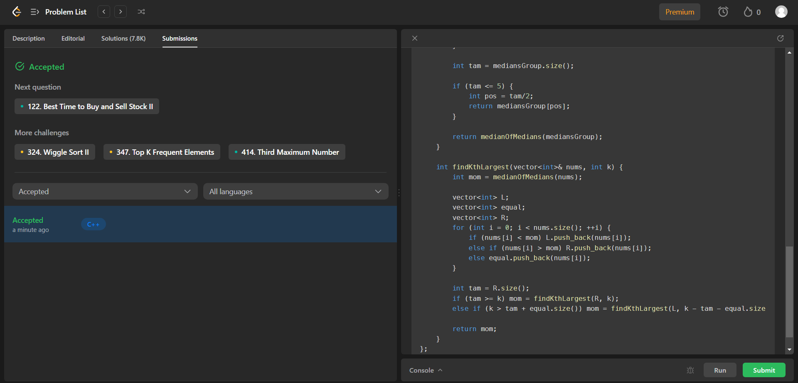
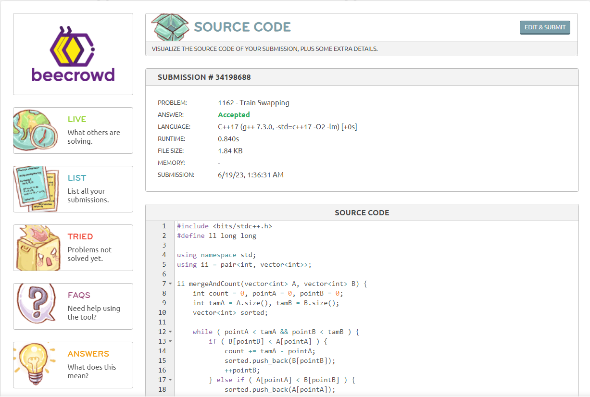
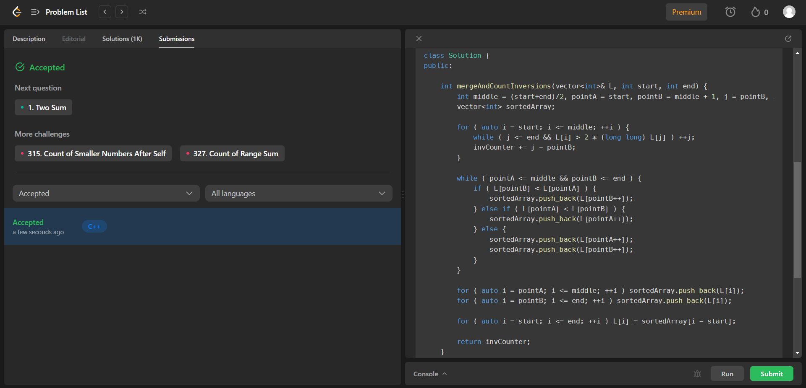
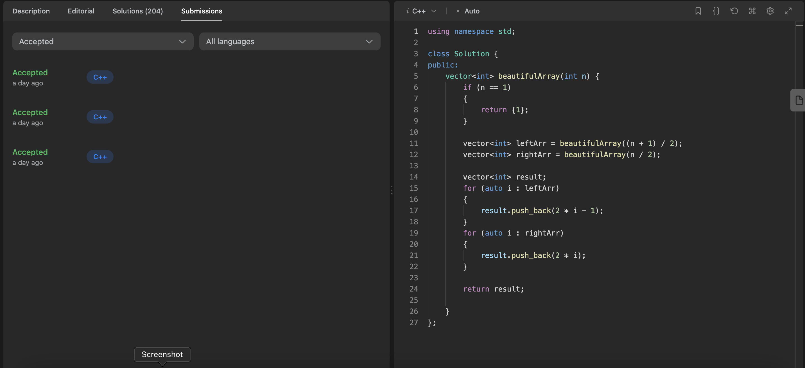
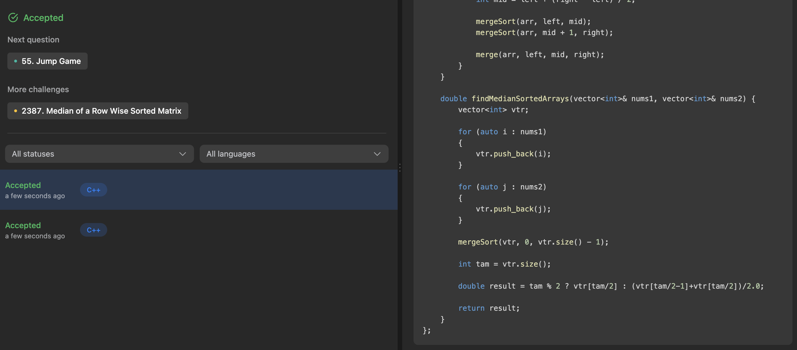
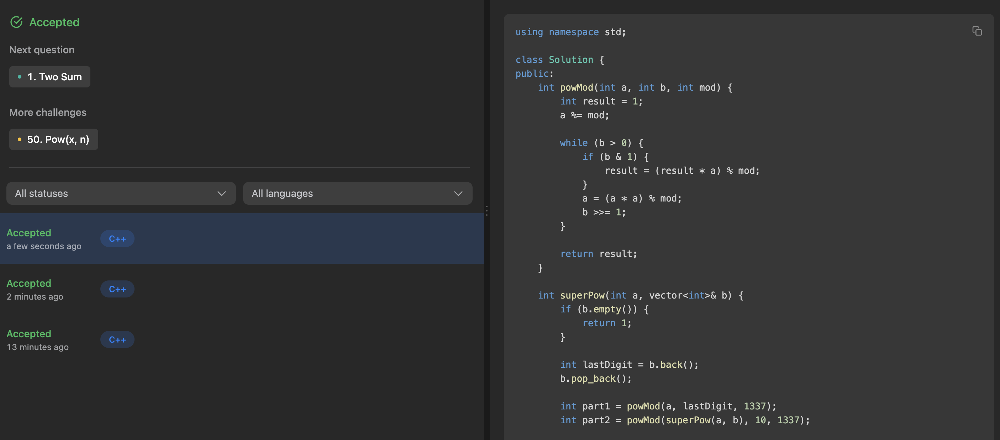
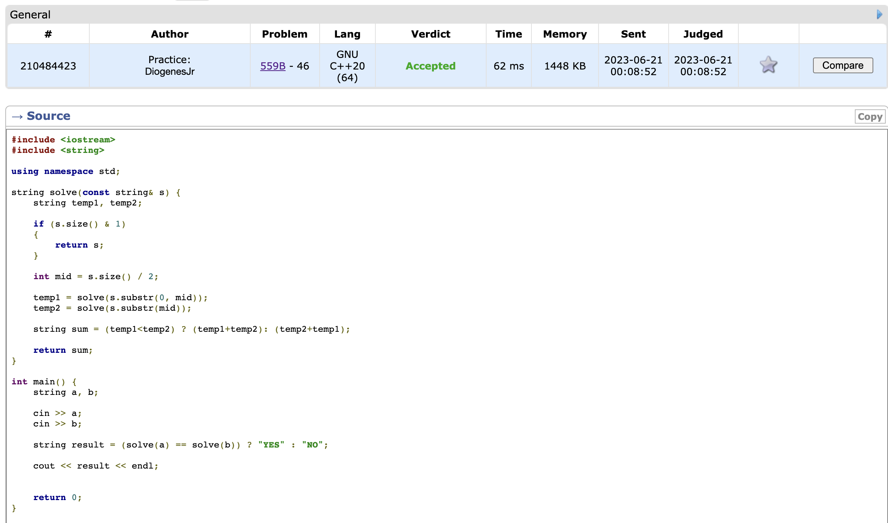

# Divisive Exercises

**Número da Lista**: Dupla 14 da Turma 02<br>
**Conteúdo da Disciplina**: Dividir e Conquistar<br>

## Alunos

|Matrícula | Aluno |
| -- | -- |
| 19/0105267  |  Diógenes Dantas Lélis Júnior |
| 20/0018167  |  Gabriel Mariano da Silva |

## Sobre

Este projeto teve como foco a resolução de problemas de **Dividir e Conquistar** (Divide and Conquer) nas plataformas *LeetCode*, *BeeCrowd* e *CodeForces*.

## Apresentação

Caso queira ver a apresentação do projeto desenvolvido por parte dos integrantes da equipe, basta acessar o [**LINK DO YOUTUBE**](https://www.youtube.com/watch?v=GjP4kitgRaU) ou então baixar o vídeo completo no [**LINK DO VÍDEO**](./video/ApresentacaoDupla14DividirEConquistar.mp4).

## Screenshots

## [215] Kth Largest Element in an Array

[**Link do Problema**](https://leetcode.com/problems/kth-largest-element-in-an-array/)

[**Resposta Comentada**](./exercises/215_KthLargestElement/commented/215_KthLargestElement.md)



## [1162] Train Swapping

[**Link do Problema**](https://www.beecrowd.com.br/judge/en/problems/view/1162)

[**Resposta Comentada**](./exercises/1162_TrainSwapping/commented/1162_TrainSwapping.md)



## [493] Reverse Pairs

[**Link do Problema**](https://leetcode.com/problems/reverse-pairs/)

[**Resposta Comentada**](./exercises/493_ReversePairs/commented/493_ReversePairs.md)



## [932] Beautiful Array

[**Link do Problema**](https://leetcode.com/problems/beautiful-array/)

[**Resposta Comentada**](./exercises/932_BeautifulArray/commented/932_beautifularray.md)



## [004] Median of Two Sorted Arrays

[**Link do Problema**](https://leetcode.com/problems/median-of-two-sorted-arrays/)

[**Resposta Comentada**](./exercises/004_MedianofTwoSortedArrays/commented/004_MedianofTwoSortedArrays.md)



## [372] Super Pow

[**Link do Problema**](https://leetcode.com/problems/super-pow/)

[**Resposta Comentada**](./exercises/372_SuperPow/commented/372_superpow.md)



## [559] Equivalent Strings

[**Link do Problema**](https://codeforces.com/problemset/problem/559/B)

[**Resposta Comentada**](./exercises/559B_EquivalentStrings/commented/559B_equivalentstrings.md)



## Instalação

**Linguagem**: *C++* (C++17)<br>
**Compilador**: *G++* <br>

* Caso não tenha o compilador *G++* instalado, veja a seção *Outros* no tópico *Compilador*.

## Execução

Alguns dos algoritmos apresentados foram executados nas respectivas plataformas de onde foram disponibilizados.

Todavia, caso deseje executar os algoritmos em sua máquina, siga os passos:

Primeiramente, clone o repositório em sua máquina:

```
git clone git@github.com:projeto-de-algoritmos/DeC_DivisiveExercises.git
```

Agora, entre na pasta do projeto e então entre na pasta *exercises*, onde as pastas para cada exercício estão:

```
cd DeC_DivisiveExercises/exercises
```

Então, entre na pasta do algoritmo do exercício desejado:

```
cd *nome da pasta do algoritmo desejado*
```

Finalmente, caso o algoritmo seja passível de execução em máquina local (ver seção **Outros**), basta inserir o caso de teste no arquivo *in* (caso não exista, basta criar um arquivo sem extensão com nome *in*), compilar o algoritmo e executá-lo:

```
g++ *nome_do_algoritmo*.cpp -o Exer

./Exer < in
```

## Outros

*Aviso de Referência:* os conteúdos presentes nessa seção são similares aos disponibilizados na seção de mesmo nome do projeto desenvolvido por esta equipe para algoritmos ambiciosos (ver [Greed_GreedyExercises](https://github.com/projeto-de-algoritmos/Greed_GreedyExercises)). Tal uso se deu devido à igualdade das situações que podem existir durante a execução de ambos os projetos, haja vista que estes tratam da resolução de exercícios sobre os respectivos assuntos.

### Execução em máquina local

Destaca-se apenas que os algoritmos desenvolvidos para a plataforma *LeetCode* devem ser executados na mesma e não em máquina local devido à sua estrutura. Para tal, basta entrar na página do exercício em questão, colar o código original e clicar em *Run* para executar os casos de teste disponibilizados.

### Compilador

Os algoritmos foram desenvolvidos em C++. Para compilar e executar seus arquivos, é necessário ter o compilador **G++** instalado. Para tal, basta seguir as instruções para as plataformas [*Linux*](https://linuxhint.com/install-and-use-g-on-ubuntu/) e [*Windows*](https://www.freecodecamp.org/news/how-to-install-c-and-cpp-compiler-on-windows/).

Todavia, também é possível executar os algoritmos nas plataformas de onde os exercícios foram retirados ou por ambientes de programação on-line, como, por exemplo, o [*OnlineGDB*](https://www.onlinegdb.com/).
